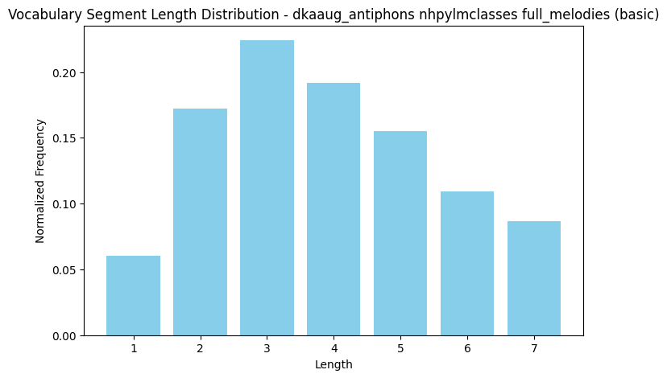
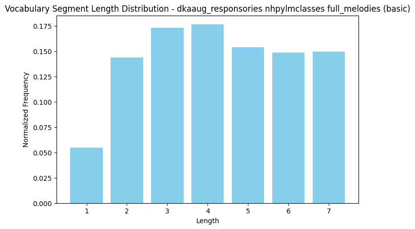
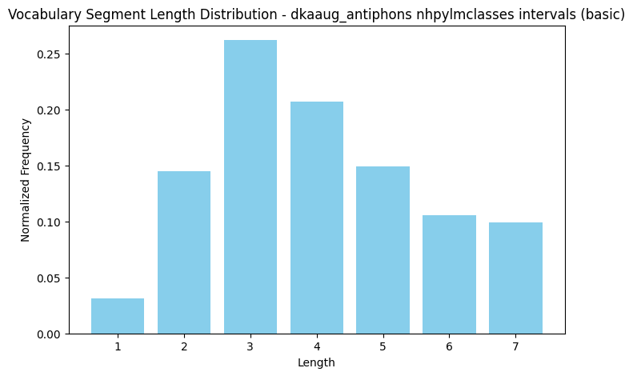
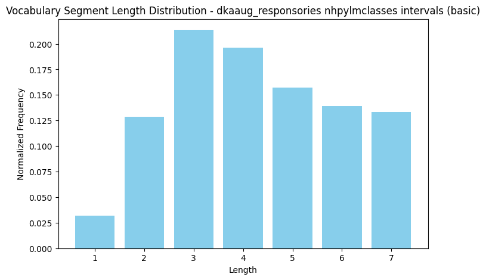
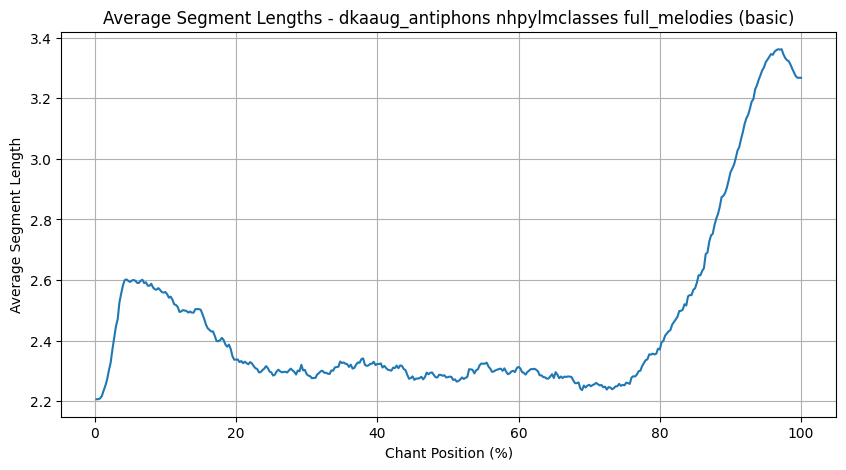
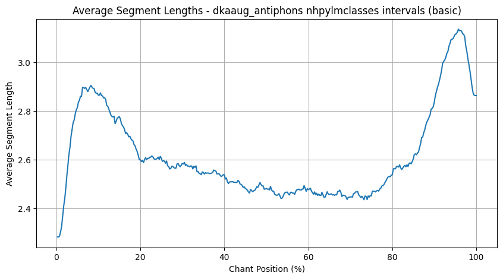
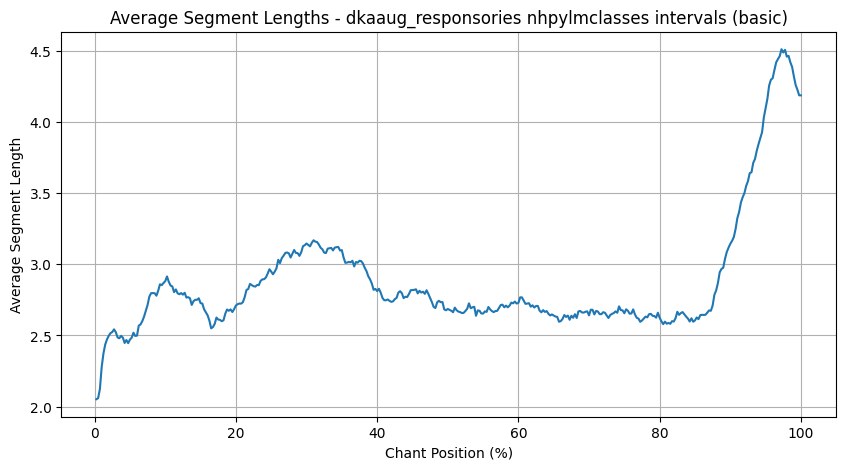

# Chant Modality with NHPYLM

## Classification Scores

#### Full Melodies

| full_melodies default | all_a acc | all_a f1 | all_r acc | all_r f1 | dka_a acc | dka_a f1 | dka_r acc | dka_r f1 | sam_a acc | sam_a f1 | sam_r acc | sam_r f1 |
|---|---|---|---|---|---|---|---|---|---|---|---|---|
| 4gram | 91.1 | 91.0 | 91.7 | 91.6 | 82.6 | 82.1 | 78.5 | 77.8 | 85.2 | 84.7 | 87.1 | 86.8 |
| 5gram | 89.9 | 89.6 | 91.0 | 91.0 | 80.7 | 80.0 | 75.4 | 74.7 | 81.5 | 81.1 | 85.1 | 84.7 |
| 6gram | 87.1 | 86.8 | 88.4 | 88.3 | 75.1 | 73.7 | 71.0 | 70.1 | 78.9 | 78.1 | 79.7 | 79.3 |
| neumes | 88.9 | 88.8 | 92.7 | 92.7 | 83.8 | 83.0 | 84.0 | 83.7 | 86.9 | 86.8 | 90.5 | 90.4 |
| syllables | 89.4 | 89.3 | 93.6 | 93.5 | 83.9 | 83.3 | 83.2 | 82.8 | 87.0 | 86.8 | 90.9 | 90.8 |
| words | 90.2 | 90.1 | 90.3 | 90.2 | 79.5 | 78.8 | 71.7 | 70.4 | 81.9 | 81.4 | 79.4 | 79.0 |
| nhpylm | 91.8 | 91.7 | 93.3 | 93.3 | 86.3 | 86.0 | 83.8 | 83.6 | 88.0 | 87.9 | 89.8 | 89.8 |
| nhpylmclasses_sc | 92.4 | 92.4 | 93.9 | 93.9 | 85.3 | 85.5 | 84.0 | 84.1 | 89.1 | 89.2 | 90.7 | 90.7 |
| nhpylmclasses | 92.6 | 92.6 | 93.9 | 93.9 | 86.1 | 86.2 | 83.8 | 83.9 | 89.3 | 89.3 | 90.8 | 90.8 |
| 6gram_overlap | 90.9 | 90.7 | 93.8 | 93.8 | 83.0 | 82.4 | 81.9 | 81.6 | 84.1 | 83.7 | 88.5 | 88.4 |
| 1_7gram_overlap | 93.8 | 93.8 | 94.8 | 94.8 | 87.2 | 87.0 | 87.0 | 86.9 | 90.4 | 90.3 | 92.6 | 92.5 |

| full_melodies liq | all_a acc | all_a f1 | all_r acc | all_r f1 | dka_a acc | dka_a f1 | dka_r acc | dka_r f1 | sam_a acc | sam_a f1 | sam_r acc | sam_r f1 |
|---|---|---|---|---|---|---|---|---|---|---|---|---|
| 4gram | 90.9 | 90.7 | 91.5 | 91.5 | 82.8 | 82.3 | 78.9 | 78.2 | 85.6 | 85.3 | 87.4 | 87.2 |
| 5gram | 90.9 | 90.7 | 91.2 | 91.1 | 81.3 | 80.5 | 76.1 | 75.3 | 83.2 | 82.8 | 84.6 | 84.3 |
| 6gram | 88.8 | 88.5 | 89.0 | 88.8 | 76.5 | 75.2 | 70.1 | 69.4 | 80.6 | 79.9 | 80.0 | 79.6 |
| neumes | 88.7 | 88.6 | 92.5 | 92.5 | 83.9 | 83.2 | 84.1 | 83.9 | 86.8 | 86.7 | 90.8 | 90.7 |
| syllables | 89.2 | 89.1 | 93.7 | 93.7 | 84.0 | 83.2 | 83.5 | 83.1 | 87.2 | 87.1 | 91.0 | 91.0 |
| words | 90.5 | 90.4 | 90.7 | 90.7 | 79.7 | 78.9 | 72.1 | 71.1 | 82.3 | 81.8 | 80.4 | 80.0 |
| nhpylm | 91.8 | 91.7 | 93.5 | 93.4 | 85.7 | 85.3 | 84.0 | 83.9 | 87.5 | 87.4 | 90.4 | 90.4 |
| nhpylmclasses_sc | 92.6 | 92.6 | 93.8 | 93.8 | 86.7 | 86.7 | 84.2 | 84.3 | 88.7 | 88.7 | 90.7 | 90.7 |
| nhpylmclasses | 92.8 | 92.7 | 93.9 | 93.9 | 87.1 | 87.1 | 83.8 | 83.9 | 89.3 | 89.3 | 90.9 | 91.0 |
| 6gram_overlap | 91.6 | 91.5 | 94.1 | 94.1 | 84.5 | 84.0 | 83.0 | 82.6 | 85.4 | 85.0 | 88.9 | 88.8 |
| 1_7gram_overlap | 93.9 | 93.9 | 94.9 | 94.9 | 87.3 | 87.1 | 86.7 | 86.7 | 90.5 | 90.4 | 92.1 | 92.0 |

| full_melodies sci | all_a acc | all_a f1 | all_r acc | all_r f1 | dka_a acc | dka_a f1 | dka_r acc | dka_r f1 | sam_a acc | sam_a f1 | sam_r acc | sam_r f1 |
|---|---|---|---|---|---|---|---|---|---|---|---|---|
| 4gram | 89.7 | 89.5 | 88.1 | 88.0 | 83.1 | 82.5 | 77.8 | 76.7 | 83.4 | 82.8 | 83.5 | 83.0 |
| 5gram | 87.3 | 87.0 | 86.0 | 85.9 | 80.4 | 79.8 | 75.7 | 75.0 | 80.4 | 79.7 | 82.7 | 82.3 |
| 6gram | 84.0 | 83.6 | 83.1 | 82.9 | 75.5 | 74.3 | 71.2 | 69.8 | 75.7 | 74.6 | 74.6 | 73.2 |
| neumes | 87.8 | 87.7 | 88.9 | 88.9 | 84.6 | 83.9 | 82.6 | 82.0 | 85.6 | 85.3 | 87.2 | 87.0 |
| syllables | 87.5 | 87.4 | 88.8 | 88.8 | 85.0 | 84.3 | 81.5 | 81.0 | 85.5 | 85.1 | 88.4 | 88.2 |
| words | 83.7 | 83.4 | 78.3 | 78.1 | 78.1 | 77.3 | 71.0 | 69.8 | 79.3 | 78.5 | 73.7 | 72.7 |
| nhpylm | 89.4 | 89.3 | 89.1 | 89.0 | 87.1 | 86.8 | 83.1 | 83.1 | 86.8 | 86.6 | 87.4 | 87.4 |
| nhpylmclasses_sc | 89.2 | 89.2 | 89.4 | 89.3 | 86.7 | 86.6 | 84.4 | 84.4 | 87.8 | 87.8 | 88.5 | 88.5 |
| nhpylmclasses | 89.5 | 89.5 | 89.5 | 89.5 | 87.2 | 87.1 | 84.3 | 84.3 | 88.0 | 88.0 | 88.2 | 88.2 |
| 6gram_overlap | 86.6 | 86.4 | 88.1 | 88.0 | 83.0 | 82.5 | 80.0 | 79.5 | 82.6 | 82.1 | 85.8 | 85.3 |
| 1_7gram_overlap | 91.1 | 91.1 | 89.9 | 89.9 | 87.2 | 87.1 | 85.3 | 85.1 | 88.4 | 88.2 | 89.1 | 89.0 |

| full_melodies sciliq | all_a acc | all_a f1 | all_r acc | all_r f1 | dka_a acc | dka_a f1 | dka_r acc | dka_r f1 | sam_a acc | sam_a f1 | sam_r acc | sam_r f1 |
|---|---|---|---|---|---|---|---|---|---|---|---|---|
| 4gram | 90.0 | 89.8 | 88.6 | 88.5 | 84.0 | 83.4 | 78.1 | 77.1 | 83.9 | 83.4 | 84.2 | 83.7 |
| 5gram | 89.0 | 88.8 | 87.1 | 87.0 | 80.6 | 79.9 | 75.4 | 74.7 | 82.2 | 81.5 | 82.9 | 82.5 |
| 6gram | 85.8 | 85.5 | 84.0 | 83.8 | 77.7 | 76.3 | 70.4 | 68.8 | 77.9 | 76.9 | 76.7 | 75.7 |
| neumes | 87.5 | 87.4 | 89.2 | 89.2 | 85.2 | 84.7 | 83.0 | 82.5 | 85.2 | 84.9 | 87.7 | 87.5 |
| syllables | 87.8 | 87.6 | 89.2 | 89.1 | 84.9 | 84.4 | 82.5 | 82.2 | 85.9 | 85.6 | 87.8 | 87.7 |
| words | 84.2 | 84.0 | 78.9 | 78.7 | 79.3 | 78.4 | 71.7 | 70.2 | 80.3 | 79.5 | 73.8 | 73.0 |
| nhpylm | 89.5 | 89.4 | 89.0 | 89.0 | 86.5 | 86.4 | 83.1 | 82.9 | 87.3 | 87.2 | 87.4 | 87.3 |
| nhpylmclasses_sc | 89.1 | 89.1 | 89.1 | 89.1 | 86.5 | 86.4 | 83.5 | 83.3 | 87.9 | 87.8 | 88.3 | 88.4 |
| nhpylmclasses | 89.5 | 89.5 | 89.2 | 89.1 | 87.0 | 87.0 | 83.8 | 83.6 | 88.5 | 88.4 | 88.3 | 88.3 |
| 6gram_overlap | 87.7 | 87.6 | 88.4 | 88.4 | 83.9 | 83.4 | 81.7 | 81.1 | 83.9 | 83.3 | 86.4 | 86.0 |
| 1_7gram_overlap | 91.5 | 91.5 | 90.1 | 90.1 | 87.7 | 87.6 | 85.1 | 84.9 | 89.0 | 88.8 | 89.2 | 89.1 |

 #### Merged Tones

| merged_tones default | all_a acc | all_a f1 | all_r acc | all_r f1 | dka_a acc | dka_a f1 | dka_r acc | dka_r f1 | sam_a acc | sam_a f1 | sam_r acc | sam_r f1 |
|---|---|---|---|---|---|---|---|---|---|---|---|---|
| 4gram | 90.2 | 90.0 | 90.3 | 90.2 | 81.7 | 81.1 | 74.9 | 74.0 | 83.9 | 83.4 | 82.9 | 82.5 |
| 5gram | 88.8 | 88.5 | 89.9 | 89.8 | 78.7 | 78.1 | 74.3 | 73.4 | 79.7 | 79.0 | 82.0 | 81.6 |
| 6gram | 87.1 | 86.7 | 88.4 | 88.3 | 75.8 | 74.6 | 71.0 | 70.1 | 76.2 | 75.1 | 80.1 | 79.7 |
| neumes | 89.1 | 89.0 | 92.4 | 92.4 | 83.7 | 83.0 | 83.7 | 83.4 | 87.2 | 87.0 | 90.3 | 90.1 |
| syllables | 89.5 | 89.4 | 93.7 | 93.7 | 84.3 | 83.6 | 83.5 | 83.3 | 86.9 | 86.7 | 90.5 | 90.4 |
| words | 89.5 | 89.5 | 92.1 | 92.0 | 80.3 | 79.6 | 76.6 | 75.5 | 81.7 | 81.3 | 82.9 | 82.7 |
| nhpylm | 90.2 | 90.1 | 92.1 | 92.0 | 82.2 | 81.7 | 81.5 | 81.3 | 84.2 | 84.0 | 88.6 | 88.4 |
| nhpylmclasses_sc | 91.5 | 91.5 | 93.4 | 93.4 | 85.7 | 85.7 | 82.9 | 83.1 | 87.7 | 87.8 | 90.5 | 90.5 |
| nhpylmclasses | 91.8 | 91.8 | 93.4 | 93.4 | 86.0 | 85.9 | 82.9 | 83.0 | 88.0 | 88.1 | 90.7 | 90.7 |
| 6gram_overlap | 89.6 | 89.4 | 93.3 | 93.3 | 80.8 | 80.3 | 79.8 | 79.4 | 81.0 | 80.5 | 87.4 | 87.2 |
| 1_7gram_overlap | 92.8 | 92.8 | 94.2 | 94.2 | 85.7 | 85.5 | 82.1 | 81.8 | 86.3 | 86.2 | 90.5 | 90.5 |

| merged_tones liq | all_a acc | all_a f1 | all_r acc | all_r f1 | dka_a acc | dka_a f1 | dka_r acc | dka_r f1 | sam_a acc | sam_a f1 | sam_r acc | sam_r f1 |
|---|---|---|---|---|---|---|---|---|---|---|---|---|
| 4gram | 90.5 | 90.4 | 90.1 | 90.0 | 82.5 | 81.9 | 76.2 | 75.2 | 83.4 | 83.1 | 84.0 | 83.5 |
| 5gram | 90.1 | 89.9 | 90.2 | 90.1 | 79.9 | 79.4 | 74.9 | 74.0 | 82.0 | 81.4 | 82.9 | 82.3 |
| 6gram | 89.8 | 89.5 | 89.2 | 89.1 | 77.2 | 76.4 | 71.2 | 70.1 | 79.2 | 78.4 | 80.0 | 79.3 |
| neumes | 89.0 | 88.9 | 92.5 | 92.5 | 84.1 | 83.4 | 83.8 | 83.5 | 87.2 | 87.0 | 90.1 | 89.9 |
| syllables | 89.5 | 89.4 | 93.9 | 93.8 | 84.1 | 83.3 | 83.0 | 82.8 | 87.3 | 87.1 | 91.4 | 91.4 |
| words | 90.1 | 90.0 | 92.4 | 92.4 | 79.9 | 79.3 | 75.7 | 74.8 | 82.6 | 82.2 | 84.1 | 83.9 |
| nhpylm | 90.6 | 90.6 | 92.3 | 92.3 | 83.7 | 83.4 | 81.5 | 81.3 | 85.2 | 85.0 | 87.9 | 87.9 |
| nhpylmclasses_sc | 92.1 | 92.1 | 93.2 | 93.3 | 86.7 | 86.7 | 83.5 | 83.6 | 88.2 | 88.4 | 90.3 | 90.3 |
| nhpylmclasses | 92.4 | 92.4 | 93.2 | 93.3 | 87.3 | 87.3 | 83.3 | 83.4 | 89.1 | 89.2 | 90.1 | 90.1 |
| 6gram_overlap | 90.8 | 90.7 | 93.4 | 93.4 | 81.8 | 81.4 | 80.0 | 79.7 | 84.4 | 84.1 | 88.4 | 88.1 |
| 1_7gram_overlap | 93.3 | 93.3 | 94.2 | 94.2 | 85.2 | 85.0 | 83.2 | 83.0 | 87.4 | 87.3 | 90.8 | 90.8 |

| merged_tones sci | all_a acc | all_a f1 | all_r acc | all_r f1 | dka_a acc | dka_a f1 | dka_r acc | dka_r f1 | sam_a acc | sam_a f1 | sam_r acc | sam_r f1 |
|---|---|---|---|---|---|---|---|---|---|---|---|---|
| 4gram | 88.4 | 88.2 | 87.0 | 86.9 | 81.1 | 80.5 | 76.1 | 74.7 | 81.6 | 81.1 | 81.1 | 80.5 |
| 5gram | 86.9 | 86.7 | 86.0 | 85.9 | 79.0 | 78.2 | 74.3 | 73.1 | 79.2 | 78.4 | 78.6 | 77.7 |
| 6gram | 84.1 | 83.8 | 83.2 | 83.0 | 75.9 | 75.2 | 70.3 | 69.1 | 75.1 | 74.0 | 75.7 | 74.8 |
| neumes | 87.8 | 87.7 | 88.6 | 88.5 | 85.0 | 84.4 | 82.3 | 81.8 | 85.2 | 84.9 | 87.3 | 87.0 |
| syllables | 87.7 | 87.6 | 88.4 | 88.4 | 85.1 | 84.5 | 82.4 | 82.2 | 85.7 | 85.4 | 88.2 | 88.0 |
| words | 83.7 | 83.5 | 82.8 | 82.6 | 79.2 | 78.4 | 76.2 | 75.1 | 77.7 | 77.0 | 78.2 | 77.4 |
| nhpylm | 87.6 | 87.4 | 88.0 | 88.0 | 82.6 | 82.2 | 82.1 | 82.0 | 83.4 | 83.3 | 85.5 | 85.4 |
| nhpylmclasses_sc | 89.5 | 89.5 | 89.1 | 89.1 | 85.2 | 85.1 | 83.4 | 83.3 | 87.4 | 87.5 | 87.6 | 87.7 |
| nhpylmclasses | 89.9 | 89.9 | 89.1 | 89.1 | 86.2 | 86.1 | 83.5 | 83.4 | 87.4 | 87.4 | 87.9 | 87.9 |
| 6gram_overlap | 85.7 | 85.5 | 86.8 | 86.7 | 81.6 | 81.2 | 78.9 | 78.2 | 79.7 | 78.8 | 84.6 | 84.3 |
| 1_7gram_overlap | 90.3 | 90.2 | 88.8 | 88.7 | 84.7 | 84.5 | 81.8 | 81.5 | 85.3 | 85.0 | 88.5 | 88.4 |

| merged_tones sciliq | all_a acc | all_a f1 | all_r acc | all_r f1 | dka_a acc | dka_a f1 | dka_r acc | dka_r f1 | sam_a acc | sam_a f1 | sam_r acc | sam_r f1 |
|---|---|---|---|---|---|---|---|---|---|---|---|---|
| 4gram | 89.2 | 89.1 | 86.8 | 86.7 | 83.2 | 82.7 | 76.3 | 75.1 | 83.9 | 83.2 | 82.0 | 81.5 |
| 5gram | 88.2 | 88.0 | 86.7 | 86.6 | 80.4 | 79.5 | 75.5 | 74.6 | 82.0 | 81.2 | 80.1 | 79.4 |
| 6gram | 87.0 | 86.8 | 84.5 | 84.3 | 77.8 | 77.0 | 70.0 | 68.7 | 78.4 | 77.6 | 77.1 | 76.1 |
| neumes | 87.6 | 87.4 | 89.4 | 89.3 | 84.9 | 84.4 | 83.1 | 82.7 | 85.7 | 85.3 | 87.4 | 87.1 |
| syllables | 87.5 | 87.4 | 88.6 | 88.5 | 84.9 | 84.4 | 84.0 | 83.8 | 85.8 | 85.5 | 88.1 | 87.9 |
| words | 84.5 | 84.4 | 83.4 | 83.3 | 79.8 | 79.3 | 75.9 | 74.9 | 79.4 | 78.8 | 78.6 | 77.9 |
| nhpylm | 88.4 | 88.3 | 87.8 | 87.8 | 83.5 | 83.1 | 81.9 | 81.6 | 83.9 | 83.7 | 85.7 | 85.5 |
| nhpylmclasses_sc | 89.9 | 90.0 | 88.9 | 88.9 | 86.4 | 86.5 | 83.5 | 83.4 | 87.8 | 87.9 | 89.3 | 89.3 |
| nhpylmclasses | 90.6 | 90.6 | 89.0 | 89.0 | 87.4 | 87.3 | 83.2 | 83.1 | 87.8 | 87.8 | 89.6 | 89.5 |
| 6gram_overlap | 87.2 | 87.0 | 86.8 | 86.7 | 82.9 | 82.5 | 80.1 | 79.5 | 82.4 | 81.8 | 85.3 | 85.1 |
| 1_7gram_overlap | 91.0 | 91.0 | 89.0 | 88.9 | 85.6 | 85.4 | 83.2 | 82.9 | 86.4 | 86.1 | 88.3 | 88.2 |

#### Intervals

| intervals default | all_a acc | all_a f1 | all_r acc | all_r f1 | dka_a acc | dka_a f1 | dka_r acc | dka_r f1 | sam_a acc | sam_a f1 | sam_r acc | sam_r f1 |
|---|---|---|---|---|---|---|---|---|---|---|---|---|
| 4gram | 82.3 | 82.0 | 83.3 | 83.1 | 72.2 | 70.7 | 65.7 | 64.5 | 69.6 | 68.0 | 72.2 | 71.4 |
| 5gram | 83.3 | 82.8 | 84.2 | 83.9 | 71.7 | 69.9 | 65.7 | 64.3 | 72.2 | 71.0 | 75.1 | 74.2 |
| 6gram | 81.9 | 81.3 | 82.7 | 82.3 | 67.3 | 65.2 | 63.4 | 62.0 | 68.3 | 66.8 | 70.1 | 69.3 |
| neumes | 71.8 | 71.2 | 86.4 | 86.2 | 61.3 | 59.8 | 70.0 | 69.0 | 63.4 | 62.2 | 77.9 | 77.4 |
| syllables | 73.4 | 72.9 | 89.4 | 89.3 | 62.4 | 61.0 | 72.9 | 71.7 | 65.6 | 64.3 | 80.1 | 79.5 |
| words | 84.2 | 83.9 | 87.3 | 87.2 | 66.2 | 64.1 | 63.2 | 61.9 | 68.7 | 67.5 | 72.5 | 71.7 |
| nhpylm | 86.9 | 86.7 | 89.7 | 89.7 | 74.4 | 73.3 | 73.2 | 72.6 | 75.8 | 74.9 | 78.7 | 78.4 |
| nhpylmclasses_sc | 90.4 | 90.3 | 92.3 | 92.3 | 81.0 | 80.6 | 79.6 | 79.5 | 80.4 | 80.2 | 84.9 | 84.9 |
| nhpylmclasses | 90.2 | 90.1 | 92.3 | 92.3 | 81.1 | 80.7 | 79.6 | 79.5 | 80.4 | 80.2 | 84.9 | 84.9 |
| 6gram_overlap | 88.1 | 87.9 | 91.7 | 91.7 | 78.1 | 77.2 | 76.3 | 75.8 | 78.8 | 78.0 | 83.6 | 83.3 |
| 1_7gram_overlap | 90.5 | 90.4 | 92.8 | 92.8 | 81.5 | 81.1 | 77.4 | 76.8 | 82.4 | 82.0 | 84.7 | 84.6 |

| intervals liq | all_a acc | all_a f1 | all_r acc | all_r f1 | dka_a acc | dka_a f1 | dka_r acc | dka_r f1 | sam_a acc | sam_a f1 | sam_r acc | sam_r f1 |
|---|---|---|---|---|---|---|---|---|---|---|---|---|
| 4gram | 82.3 | 82.0 | 83.3 | 83.1 | 72.2 | 70.7 | 65.7 | 64.5 | 69.6 | 68.0 | 72.2 | 71.4 |
| 5gram | 83.3 | 82.8 | 84.2 | 83.9 | 71.7 | 69.9 | 65.7 | 64.3 | 72.2 | 71.0 | 75.1 | 74.2 |
| 6gram | 81.9 | 81.3 | 82.7 | 82.3 | 67.3 | 65.2 | 63.4 | 62.0 | 68.3 | 66.8 | 70.1 | 69.3 |
| neumes | 71.8 | 71.2 | 86.4 | 86.2 | 61.3 | 59.8 | 70.0 | 69.0 | 63.4 | 62.2 | 77.9 | 77.4 |
| syllables | 73.4 | 72.9 | 89.4 | 89.3 | 62.4 | 61.0 | 72.9 | 71.7 | 65.6 | 64.3 | 80.1 | 79.5 |
| words | 84.2 | 83.9 | 87.3 | 87.2 | 66.2 | 64.1 | 63.2 | 61.9 | 68.7 | 67.5 | 72.5 | 71.7 |
| nhpylm | 87.0 | 86.8 | 89.9 | 89.8 | 75.2 | 74.3 | 72.7 | 71.9 | 76.3 | 75.5 | 79.6 | 79.2 |
| nhpylmclasses_sc | 90.4 | 90.3 | 92.3 | 92.3 | 80.9 | 80.3 | 78.3 | 78.2 | 82.1 | 81.8 | 83.8 | 83.9 |
| nhpylmclasses | 90.3 | 90.2 | 92.2 | 92.2 | 80.6 | 80.1 | 78.2 | 78.1 | 82.0 | 81.7 | 83.8 | 83.8 |
| 6gram_overlap | 88.1 | 87.9 | 91.7 | 91.7 | 78.1 | 77.2 | 76.3 | 75.8 | 78.8 | 78.0 | 83.6 | 83.3 |
| 1_7gram_overlap | 90.5 | 90.4 | 92.8 | 92.8 | 81.5 | 81.1 | 77.4 | 76.8 | 82.4 | 82.0 | 84.7 | 84.6 |

| intervals sci | all_a acc | all_a f1 | all_r acc | all_r f1 | dka_a acc | dka_a f1 | dka_r acc | dka_r f1 | sam_a acc | sam_a f1 | sam_r acc | sam_r f1 |
|---|---|---|---|---|---|---|---|---|---|---|---|---|
| 4gram | 78.0 | 77.5 | 76.1 | 75.6 | 70.4 | 68.5 | 64.4 | 62.8 | 68.7 | 66.7 | 68.5 | 66.8 |
| 5gram | 79.1 | 78.5 | 77.3 | 76.7 | 70.6 | 68.8 | 63.9 | 62.0 | 69.7 | 68.0 | 69.6 | 68.4 |
| 6gram | 76.2 | 75.4 | 73.9 | 73.2 | 67.8 | 65.0 | 63.6 | 61.8 | 67.0 | 65.6 | 66.8 | 64.9 |
| neumes | 67.6 | 66.9 | 79.2 | 78.9 | 62.2 | 61.0 | 71.8 | 70.9 | 63.4 | 61.9 | 74.6 | 73.7 |
| syllables | 68.0 | 67.5 | 79.5 | 79.3 | 61.9 | 60.5 | 72.9 | 71.6 | 63.8 | 62.3 | 75.2 | 74.2 |
| words | 73.7 | 73.0 | 69.3 | 68.5 | 65.7 | 63.9 | 63.2 | 61.7 | 66.3 | 64.5 | 62.1 | 60.3 |
| nhpylm | 82.2 | 81.9 | 81.3 | 81.2 | 74.2 | 73.1 | 73.3 | 72.4 | 74.1 | 73.3 | 76.3 | 75.6 |
| nhpylmclasses_sc | 85.3 | 85.1 | 85.3 | 85.3 | 79.6 | 79.3 | 78.2 | 78.2 | 80.0 | 79.4 | 79.9 | 79.6 |
| nhpylmclasses | 85.2 | 85.0 | 85.3 | 85.3 | 79.3 | 79.0 | 78.3 | 78.2 | 80.1 | 79.5 | 79.8 | 79.5 |
| 6gram_overlap | 81.7 | 81.4 | 82.8 | 82.6 | 77.6 | 76.6 | 77.3 | 76.4 | 74.4 | 73.4 | 78.8 | 77.7 |
| 1_7gram_overlap | 85.7 | 85.5 | 85.1 | 84.9 | 80.6 | 80.0 | 77.5 | 76.8 | 79.3 | 78.9 | 80.2 | 79.8 |

| intervals sciliq | all_a acc | all_a f1 | all_r acc | all_r f1 | dka_a acc | dka_a f1 | dka_r acc | dka_r f1 | sam_a acc | sam_a f1 | sam_r acc | sam_r f1 |
|---|---|---|---|---|---|---|---|---|---|---|---|---|
| 4gram | 78.0 | 77.5 | 76.1 | 75.6 | 70.4 | 68.5 | 64.4 | 62.8 | 68.7 | 66.7 | 68.5 | 66.8 |
| 5gram | 79.1 | 78.5 | 77.3 | 76.7 | 70.6 | 68.8 | 63.9 | 62.0 | 69.7 | 68.0 | 69.6 | 68.4 |
| 6gram | 76.2 | 75.4 | 73.9 | 73.2 | 67.8 | 65.0 | 63.6 | 61.8 | 67.0 | 65.6 | 66.8 | 64.9 |
| neumes | 67.6 | 66.9 | 79.2 | 78.9 | 62.2 | 61.0 | 71.8 | 70.9 | 63.4 | 61.9 | 74.6 | 73.7 |
| syllables | 68.0 | 67.5 | 79.5 | 79.3 | 61.9 | 60.5 | 72.9 | 71.6 | 63.8 | 62.3 | 75.2 | 74.2 |
| words | 73.5 | 72.8 | 69.3 | 68.5 | 65.7 | 63.9 | 63.2 | 61.7 | 66.3 | 64.5 | 62.1 | 60.3 |
| nhpylm | 82.4 | 82.1 | 81.1 | 81.0 | 74.8 | 73.7 | 73.6 | 72.7 | 73.0 | 71.9 | 75.7 | 74.9 |
| nhpylmclasses_sc | 85.3 | 85.1 | 86.0 | 86.0 | 79.5 | 78.9 | 76.4 | 76.0 | 79.6 | 79.0 | 79.6 | 79.5 |
| nhpylmclasses | 85.3 | 85.1 | 86.0 | 86.0 | 79.1 | 78.5 | 76.5 | 76.1 | 79.4 | 78.7 | 79.8 | 79.6 |
| 6gram_overlap | 82.1 | 81.7 | 82.8 | 82.6 | 77.6 | 76.6 | 77.3 | 76.4 | 74.4 | 73.4 | 78.8 | 77.7 |
| 1_7gram_overlap | 85.7 | 85.5 | 85.1 | 84.9 | 80.6 | 80.0 | 77.5 | 76.8 | 79.3 | 78.9 | 80.2 | 79.8 |

## Perplexity

#### Full Melodies

| full_melodies default | all_a perplexity | all_r perplexity | dka_a perplexity | dka_r perplexity | sam_a perplexity | sam_r perplexity |
|---|---|---|---|---|---|---|
| nhpylm | 27.87 | 24.14 | 15.37 | 13.48 | 14.98 | 13.94 |
| nhpylmclasses | 18.02 | 15.81 | 10.77 | 9.47 | 11.93 | 10.55 |

| full_melodies liq | all_a perplexity | all_r perplexity | dka_a perplexity | dka_r perplexity | sam_a perplexity | sam_r perplexity |
|---|---|---|---|---|---|---|
| nhpylm | 26.17 | 22.81 | 14.29 | 12.55 | 14.45 | 12.55 |
| nhpylmclasses | 16.79 | 14.1 | 10.19 | 8.68 | 10.42 | 9.54 |

| full_melodies sci | all_a perplexity | all_r perplexity | dka_a perplexity | dka_r perplexity | sam_a perplexity | sam_r perplexity |
|---|---|---|---|---|---|---|
| nhpylm | 28.37 | 24.54 | 15.26 | 13.2 | 14.55 | 13.77 |
| nhpylmclasses | 19.15 | 17.2 | 11.07 | 9.57 | 11.84 | 10.77 |

| full_melodies sciliq | all_a perplexity | all_r perplexity | dka_a perplexity | dka_r perplexity | sam_a perplexity | sam_r perplexity |
|---|---|---|---|---|---|---|
| nhpylm | 27.02 | 23.71 | 15.08 | 12.87 | 13.79 | 12.51 |
| nhpylmclasses | 17.26 | 16.02 | 10.12 | 8.59 | 10.49 | 9.48 |

#### Merged Tones

| merged_tones default | all_a perplexity | all_r perplexity | dka_a perplexity | dka_r perplexity | sam_a perplexity | sam_r perplexity |
|---|---|---|---|---|---|---|
| nhpylm | 21.76 | 16.85 | 11.46 | 9.33 | 11.73 | 10.03 |
| nhpylmclasses | 13.77 | 10.95 | 8.46 | 6.91 | 9.21 | 7.59 |

| merged_tones liq | all_a perplexity | all_r perplexity | dka_a perplexity | dka_r perplexity | sam_a perplexity | sam_r perplexity |
|---|---|---|---|---|---|---|
| nhpylm | 20.02 | 16.11 | 11.31 | 9.22 | 12.13 | 9.38 |
| nhpylmclasses | 12.71 | 10.25 | 8.06 | 6.25 | 8.42 | 6.94 |

| merged_tones sci | all_a perplexity | all_r perplexity | dka_a perplexity | dka_r perplexity | sam_a perplexity | sam_r perplexity |
|---|---|---|---|---|---|---|
| nhpylm | 23.39 | 17.75 | 11.38 | 9.66 | 12.07 | 9.75 |
| nhpylmclasses | 14.64 | 11.47 | 8.48 | 6.96 | 9.05 | 7.89 |

| merged_tones sciliq | all_a perplexity | all_r perplexity | dka_a perplexity | dka_r perplexity | sam_a perplexity | sam_r perplexity |
|---|---|---|---|---|---|---|
| nhpylm | 22.18 | 16.81 | 10.92 | 9.14 | 11.59 | 9.46 |
| nhpylmclasses | 13.07 | 10.65 | 7.63 | 6.33 | 8.71 | 6.76 |

#### Intervals

| intervals default | all_a perplexity | all_r perplexity | dka_a perplexity | dka_r perplexity | sam_a perplexity | sam_r perplexity |
|---|---|---|---|---|---|---|
| nhpylm | 31.81 | 26.8 | 19.95 | 17.71 | 21.01 | 18.77 |
| nhpylmclasses | 20.22 | 18.23 | 15.22 | 13.67 | 15.58 | 15.15 |

| intervals liq | all_a perplexity | all_r perplexity | dka_a perplexity | dka_r perplexity | sam_a perplexity | sam_r perplexity |
|---|---|---|---|---|---|---|
| nhpylm | 32.95 | 27.5 | 19.05 | 16.64 | 21.43 | 19.23 |
| nhpylmclasses | 20.32 | 18.03 | 14.76 | 13.89 | 15.24 | 15.39 |

| intervals sci | all_a perplexity | all_r perplexity | dka_a perplexity | dka_r perplexity | sam_a perplexity | sam_r perplexity |
|---|---|---|---|---|---|---|
| nhpylm | 34.45 | 31.13 | 19.07 | 17.39 | 21.71 | 17.93 |
| nhpylmclasses | 22.48 | 21.9 | 15.12 | 13.39 | 15.75 | 16.53 |

| intervals sciliq | all_a perplexity | all_r perplexity | dka_a perplexity | dka_r perplexity | sam_a perplexity | sam_r perplexity |
|---|---|---|---|---|---|---|
| nhpylm | 36.31 | 31.61 | 19.57 | 17.61 | 22.32 | 19.03 |
| nhpylmclasses | 22.66 | 21.7 | 14.67 | 13.44 | 16.56 | 15.69 |

## Average Segment Lengths

## D-KA Aug. Source

#### Training Scores

##### FULL MELODIES

| full_melodies default | dka_a acc | dka_a f1 | dka_r acc | dka_r f1 |
|---|---|---|---|---|
| 4gram | 98.8 | 98.8 | 99.0 | 99.0 |
| 5gram | 100.0 | 100.0 | 100.0 | 100.0 |
| 6gram | 100.0 | 100.0 | 100.0 | 100.0 |
| neumes | 91.1 | 90.9 | 94.1 | 94.1 |
| syllables | 91.6 | 91.4 | 98.9 | 98.9 |
| words | 99.6 | 99.6 | 99.9 | 99.9 |
| nhpylm_joint | 96.1 | 96.0 | 96.3 | 96.3 |
| nhpylmclasses_joint_sc | 97.5 | 97.5 | 97.4 | 97.4 |
| nhpylmclasses_joint | 97.9 | 97.9 | 99.2 | 99.2 |
| 6gram_overlap | 99.9 | 99.9 | 99.7 | 99.7 |
| 1_7gram_overlap | 99.9 | 99.9 | 96.1 | 96.1 |

| full_melodies liq | dka_a acc | dka_a f1 | dka_r acc | dka_r f1 |
|---|---|---|---|---|
| 4gram | 98.4 | 98.4 | 98.9 | 98.9 |
| 5gram | 99.9 | 99.9 | 100.0 | 100.0 |
| 6gram | 100.0 | 100.0 | 100.0 | 100.0 |
| neumes | 91.6 | 91.4 | 95.7 | 95.7 |
| syllables | 91.8 | 91.6 | 98.8 | 98.8 |
| words | 99.8 | 99.8 | 99.9 | 99.9 |
| nhpylm_joint | 94.9 | 94.9 | 95.2 | 95.2 |
| nhpylmclasses_joint_sc | 97.3 | 97.3 | 96.8 | 96.8 |
| nhpylmclasses_joint | 97.9 | 97.9 | 98.2 | 98.2 |
| 6gram_overlap | 99.4 | 99.4 | 99.4 | 99.4 |
| 1_7gram_overlap | 99.6 | 99.6 | 97.3 | 97.3 |

| full_melodies sci | dka_a acc | dka_a f1 | dka_r acc | dka_r f1 |
|---|---|---|---|---|
| 4gram | 99.0 | 99.0 | 99.4 | 99.4 |
| 5gram | 100.0 | 100.0 | 100.0 | 100.0 |
| 6gram | 100.0 | 100.0 | 100.0 | 100.0 |
| neumes | 91.3 | 91.0 | 95.7 | 95.7 |
| syllables | 92.3 | 92.1 | 99.1 | 99.1 |
| words | 99.7 | 99.7 | 99.9 | 99.9 |
| nhpylm_joint | 96.2 | 96.2 | 96.3 | 96.3 |
| nhpylmclasses_joint_sc | 97.5 | 97.5 | 97.3 | 97.3 |
| nhpylmclasses_joint | 98.0 | 98.0 | 99.1 | 99.1 |
| 6gram_overlap | 99.8 | 99.8 | 99.3 | 99.3 |
| 1_7gram_overlap | 99.1 | 99.1 | 96.6 | 96.6 |

| full_melodies sciliq | dka_a acc | dka_a f1 | dka_r acc | dka_r f1 |
|---|---|---|---|---|
| 4gram | 98.6 | 98.5 | 99.0 | 99.0 |
| 5gram | 99.9 | 99.9 | 100.0 | 100.0 |
| 6gram | 100.0 | 100.0 | 100.0 | 100.0 |
| neumes | 92.6 | 92.4 | 94.1 | 94.1 |
| syllables | 92.3 | 92.1 | 99.3 | 99.3 |
| words | 99.7 | 99.7 | 99.9 | 99.9 |
| nhpylm_joint | 96.4 | 96.4 | 97.0 | 97.0 |
| nhpylmclasses_joint_sc | 97.5 | 97.5 | 96.8 | 96.8 |
| nhpylmclasses_joint | 98.3 | 98.3 | 98.3 | 98.3 |
| 6gram_overlap | 99.7 | 99.7 | 99.3 | 99.3 |
| 1_7gram_overlap | 99.5 | 99.5 | 96.3 | 96.3 |

##### MERGED TONES

| merged_tones default | dka_a acc | dka_a f1 | dka_r acc | dka_r f1 |
|---|---|---|---|---|
| 4gram | 97.6 | 97.6 | 97.9 | 97.9 |
| 5gram | 99.7 | 99.7 | 99.7 | 99.7 |
| 6gram | 100.0 | 100.0 | 100.0 | 100.0 |
| neumes | 91.5 | 91.3 | 93.6 | 93.6 |
| syllables | 91.7 | 91.5 | 97.9 | 97.9 |
| words | 97.8 | 97.8 | 99.8 | 99.8 |
| nhpylm_joint | 92.3 | 92.2 | 95.6 | 95.6 |
| nhpylmclasses_joint_sc | 96.5 | 96.5 | 96.3 | 96.3 |
| nhpylmclasses_joint | 96.7 | 96.7 | 97.6 | 97.6 |
| 6gram_overlap | 99.7 | 99.7 | 99.3 | 99.3 |
| 1_7gram_overlap | 99.6 | 99.6 | 98.1 | 98.1 |

| merged_tones liq | dka_a acc | dka_a f1 | dka_r acc | dka_r f1 |
|---|---|---|---|---|
| 4gram | 96.8 | 96.7 | 98.8 | 98.8 |
| 5gram | 99.6 | 99.6 | 99.5 | 99.5 |
| 6gram | 100.0 | 100.0 | 99.8 | 99.8 |
| neumes | 91.6 | 91.5 | 93.7 | 93.7 |
| syllables | 91.6 | 91.4 | 97.9 | 97.9 |
| words | 97.7 | 97.7 | 99.9 | 99.9 |
| nhpylm_joint | 93.6 | 93.6 | 95.1 | 95.1 |
| nhpylmclasses_joint_sc | 96.2 | 96.2 | 96.0 | 96.0 |
| nhpylmclasses_joint | 96.6 | 96.6 | 97.3 | 97.3 |
| 6gram_overlap | 99.8 | 99.8 | 99.3 | 99.3 |
| 1_7gram_overlap | 99.1 | 99.1 | 99.1 | 99.1 |

| merged_tones sci | dka_a acc | dka_a f1 | dka_r acc | dka_r f1 |
|---|---|---|---|---|
| 4gram | 97.4 | 97.4 | 98.2 | 98.2 |
| 5gram | 99.8 | 99.8 | 99.8 | 99.8 |
| 6gram | 100.0 | 100.0 | 100.0 | 100.0 |
| neumes | 91.8 | 91.7 | 94.0 | 93.9 |
| syllables | 91.4 | 91.2 | 98.1 | 98.1 |
| words | 98.5 | 98.5 | 99.9 | 99.9 |
| nhpylm_joint | 93.6 | 93.5 | 94.8 | 94.8 |
| nhpylmclasses_joint_sc | 96.2 | 96.2 | 96.3 | 96.3 |
| nhpylmclasses_joint | 96.7 | 96.7 | 96.6 | 96.6 |
| 6gram_overlap | 99.0 | 99.0 | 99.6 | 99.6 |
| 1_7gram_overlap | 100.0 | 100.0 | 98.1 | 98.1 |

| merged_tones sciliq | dka_a acc | dka_a f1 | dka_r acc | dka_r f1 |
|---|---|---|---|---|
| 4gram | 96.3 | 96.3 | 98.7 | 98.7 |
| 5gram | 99.5 | 99.5 | 99.5 | 99.5 |
| 6gram | 100.0 | 100.0 | 99.7 | 99.7 |
| neumes | 91.7 | 91.5 | 94.9 | 94.9 |
| syllables | 92.2 | 92.1 | 98.2 | 98.2 |
| words | 97.4 | 97.4 | 99.9 | 99.9 |
| nhpylm_joint | 93.0 | 92.9 | 96.4 | 96.4 |
| nhpylmclasses_joint_sc | 95.9 | 95.9 | 96.4 | 96.4 |
| nhpylmclasses_joint | 96.4 | 96.4 | 97.2 | 97.2 |
| 6gram_overlap | 99.5 | 99.5 | 99.2 | 99.2 |
| 1_7gram_overlap | 99.4 | 99.4 | 98.1 | 98.1 |

##### INTERVALS

| intervals default | dka_a acc | dka_a f1 | dka_r acc | dka_r f1 |
|---|---|---|---|---|
| 4gram | 99.4 | 99.4 | 99.5 | 99.5 |
| 5gram | 99.9 | 99.9 | 99.9 | 99.9 |
| 6gram | 99.9 | 99.9 | 100.0 | 100.0 |
| neumes | 82.8 | 82.6 | 97.7 | 97.7 |
| syllables | 87.6 | 87.5 | 99.2 | 99.2 |
| words | 99.8 | 99.8 | 100.0 | 100.0 |
| nhpylm_joint | 92.0 | 91.9 | 95.4 | 95.4 |
| nhpylmclasses_joint_sc | 97.8 | 97.7 | 98.4 | 98.4 |
| nhpylmclasses_joint | 98.4 | 98.4 | 99.7 | 99.7 |
| 6gram_overlap | 99.9 | 99.9 | 99.7 | 99.7 |
| 1_7gram_overlap | 99.9 | 99.9 | 99.1 | 99.1 |

| intervals liq | dka_a acc | dka_a f1 | dka_r acc | dka_r f1 |
|---|---|---|---|---|
| 4gram | 99.4 | 99.4 | 99.5 | 99.5 |
| 5gram | 99.9 | 99.9 | 99.9 | 99.9 |
| 6gram | 99.9 | 99.9 | 100.0 | 100.0 |
| neumes | 82.8 | 82.6 | 97.7 | 97.7 |
| syllables | 87.6 | 87.5 | 99.2 | 99.2 |
| words | 99.8 | 99.8 | 100.0 | 100.0 |
| nhpylm_joint | 93.6 | 93.5 | 95.7 | 95.7 |
| nhpylmclasses_joint_sc | 97.9 | 97.9 | 98.3 | 98.3 |
| nhpylmclasses_joint | 98.4 | 98.4 | 99.5 | 99.5 |
| 6gram_overlap | 99.9 | 99.9 | 99.7 | 99.7 |
| 1_7gram_overlap | 99.9 | 99.9 | 99.1 | 99.1 |

| intervals sci | dka_a acc | dka_a f1 | dka_r acc | dka_r f1 |
|---|---|---|---|---|
| 4gram | 99.0 | 99.0 | 99.5 | 99.5 |
| 5gram | 100.0 | 100.0 | 99.9 | 99.9 |
| 6gram | 99.9 | 99.9 | 100.0 | 100.0 |
| neumes | 84.3 | 84.2 | 98.3 | 98.3 |
| syllables | 87.8 | 87.7 | 99.4 | 99.4 |
| words | 99.6 | 99.6 | 100.0 | 100.0 |
| nhpylm_joint | 93.3 | 93.2 | 96.0 | 96.0 |
| nhpylmclasses_joint_sc | 97.9 | 97.9 | 98.2 | 98.2 |
| nhpylmclasses_joint | 98.5 | 98.5 | 99.3 | 99.3 |
| 6gram_overlap | 100.0 | 100.0 | 99.8 | 99.8 |
| 1_7gram_overlap | 99.8 | 99.8 | 99.3 | 99.2 |

| intervals sciliq | dka_a acc | dka_a f1 | dka_r acc | dka_r f1 |
|---|---|---|---|---|
| 4gram | 99.0 | 99.0 | 99.5 | 99.5 |
| 5gram | 100.0 | 100.0 | 99.9 | 99.9 |
| 6gram | 99.9 | 99.9 | 100.0 | 100.0 |
| neumes | 84.3 | 84.2 | 98.3 | 98.3 |
| syllables | 87.8 | 87.7 | 99.4 | 99.4 |
| words | 99.6 | 99.6 | 100.0 | 100.0 |
| nhpylm_joint | 93.7 | 93.6 | 97.5 | 97.5 |
| nhpylmclasses_joint_sc | 97.8 | 97.8 | 98.2 | 98.2 |
| nhpylmclasses_joint | 97.9 | 97.9 | 99.3 | 99.3 |
| 6gram_overlap | 100.0 | 100.0 | 99.8 | 99.8 |
| 1_7gram_overlap | 99.8 | 99.8 | 99.3 | 99.2 |

#### Perplexities

##### FULL MELODIES

| full_melodies default | dka_a perplexity | dka_r perplexity |
|---|---|---|
| nhpylm_joint | 16.01 | 13.38 |
| nhpylmclasses_joint | 10.25 | 8.73 |

| full_melodies liq | dka_a perplexity | dka_r perplexity |
|---|---|---|
| nhpylm_joint | 14.99 | 12.83 |
| nhpylmclasses_joint | 9.56 | 8.48 |

| full_melodies sci | dka_a perplexity | dka_r perplexity |
|---|---|---|
| nhpylm_joint | 15.27 | 13.35 |
| nhpylmclasses_joint | 10.11 | 8.65 |

| full_melodies sciliq | dka_a perplexity | dka_r perplexity |
|---|---|---|
| nhpylm_joint | 15.28 | 12.63 |
| nhpylmclasses_joint | 9.75 | 8.21 |

##### MERGED TONES

| merged_tones default | dka_a perplexity | dka_r perplexity |
|---|---|---|
| nhpylm_joint | 12.14 | 9.72 |
| nhpylmclasses_joint | 8.1 | 6.29 |

| merged_tones liq | dka_a perplexity | dka_r perplexity |
|---|---|---|
| nhpylm_joint | 12.2 | 9.21 |
| nhpylmclasses_joint | 7.89 | 6.1 |

| merged_tones sci | dka_a perplexity | dka_r perplexity |
|---|---|---|
| nhpylm_joint | 11.94 | 9.59 |
| nhpylmclasses_joint | 7.95 | 6.38 |

| merged_tones sciliq | dka_a perplexity | dka_r perplexity |
|---|---|---|
| nhpylm_joint | 11.9 | 9.4 |
| nhpylmclasses_joint | 7.79 | 6.13 |

##### INTERVALS

| intervals default | dka_a perplexity | dka_r perplexity |
|---|---|---|
| nhpylm_joint | 17.41 | 15.03 |
| nhpylmclasses_joint | 11.58 | 10.42 |

| intervals liq | dka_a perplexity | dka_r perplexity |
|---|---|---|
| nhpylm_joint | 17.37 | 15.39 |
| nhpylmclasses_joint | 11.49 | 10.19 |

| intervals sci | dka_a perplexity | dka_r perplexity |
|---|---|---|
| nhpylm_joint | 18.0 | 15.51 |
| nhpylmclasses_joint | 11.35 | 10.15 |

| intervals sciliq | dka_a perplexity | dka_r perplexity |
|---|---|---|
| nhpylm_joint | 18.41 | 15.52 |
| nhpylmclasses_joint | 11.35 | 10.24 |