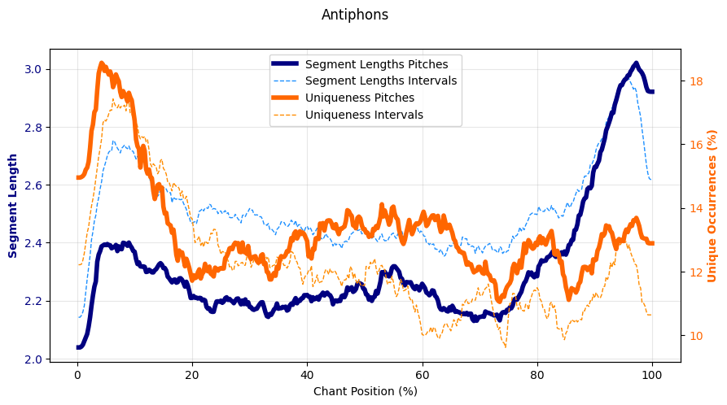
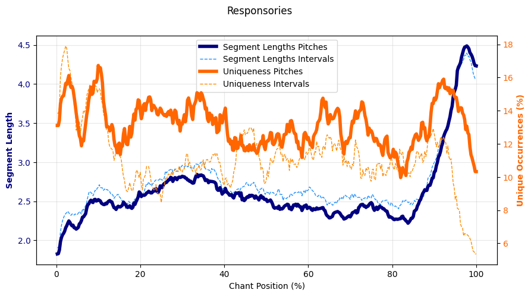
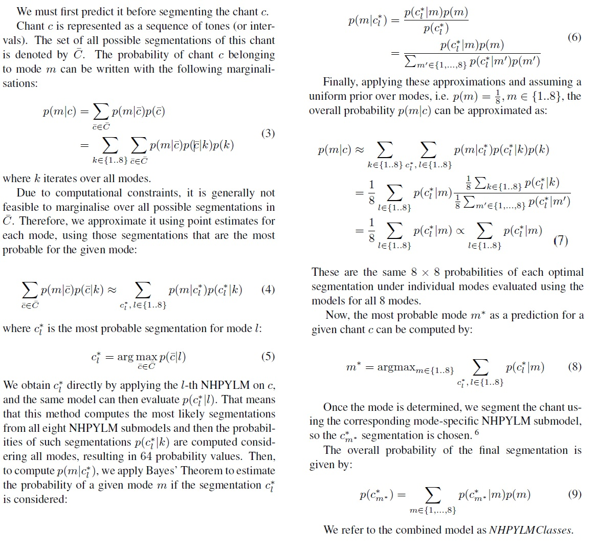

# Chant Modality with NHPYLM

This repository provides the source code for the paper **Gregorian Modality, Memory, and Bayesian Nonparametrics**. It explores an information-theoretic approach to segmenting Gregorian chant melodies using the Nested Hierarchical Pitman-Yor Language Model (NHPYLM). This approach is inspired by the memorization process of Gregorian chant and utilizes Bayesian methods to uncover optimal segmentations that can improve modality classification.


## NHPYLM Generates New Best Segmentation!

We apply the minimum description length (MDL) principle to find optimal segmentations of chant melodies. Using NHPYLM, we achieve state-of-the-art results in mode classification based on melody segmentation, showing how the segmentation process can enhance our understanding of Gregorian chant modality.

| CantusCorpus v0.2 data         | Pitches (Antiphons) | Pitches (Responsories) | Intervals (Antiphons) | Intervals (Responsories) |
|--------------------------------|---------------------|------------------------|-----------------------|--------------------------|
| *Classical approach*           | *89.6*             | *89.4*                 | --                    | --                       |
| **4-gram**                     | 91.0               | 91.6                    | 82.0                   | 83.1                     |
| **Syllables**                   | 89.3               | ***93.5***              | 72.9                   | 89.3                     |
| **Words**                       | 90.1               | 90.2                    | 83.9                   | 87.2                     |
| **NHPYLM**                      | 91.7               | 93.3                    | 86.7                   | 89.7                     |
| **NHPYLMClasses, no SVM**        | ***92.6***         | ***93.8***              | **90.4**               | **92.4**                 |
| **NHPYLMClasses**               | **92.7**           | **93.9**                | ***90.2***             | **92.4**                 |
| *Overlapping n-grams, 1-7*      | *93.8*             | *94.8*                  | *90.4*                 | *92.8*                   |

The remaining results can be found in [RESULTS.md](./RESULTS.md).

### Beginnings and Ends Are Important!

Through the segmentation process, we observe that the beginnings and ends of chants play a more significant role in memorization and classification than the middle sections. This empirical observation supports the musicological argument that chant beginnings and endings connect antiphons, responsories, psalm tones, and responsory verses.

Segmentation based on the NHPYLMClassesModel:





## Supported settings
The code provides functionality for various settings and models used for segmentation and classification tasks:


Datasets - Cantus Corpus v0.2
 - All Antiphons
 - All Responsories
 - Antiphons from D-KA Aug. source
 - Responsories from D-KA Aug. source
 - Randomly sampled antiphons to match counts from the D-KA Aug. source
 - Randomly sampled responsories to match counts from the D-KA Aug. source

Segmentations
 - 4gram (baseline)
 - 5gram (baseline)
 - 6gram (baseline)
 - Words (baseline)
 - Neumes (baseline)
 - Syllables (baseline)
 - NHPYLM
 - NHPYLMClassesModel
 - 6gram_overlap (upperbound)
 - 1_7gram_overlap (upperboud)

Representations
 - full melodies (pitch representation)
 - merged melodies (pitches merged when neighboring)
 - intervals (interval-based representation)

You can choose to keep or ignore liquescents and configure the dataset to ensure test melodies are free from similar melodies based on cantus IDs, allowing for robust evaluation.


The baselines, Cantus Corpus loaders, and representation encoders are adapted from the following repository: https://github.com/bacor/ISMIR2020.


## How to run all experiments
 - Download the Cantus Corpus v0.2 dataset from [here](https://github.com/bacor/cantuscorpus/releases/tag/v0.2).
 - Put the `chant.csv` file into the `./data/cantuscorpus-v0.2/csv/` directory in the root of this repository (create the director first).

### Generate all segmentations
(Baseline experiments (single experiment in the loop) take several seconds, while NHPYLM experiments range from several hours to up to 3.5 days.)
```sh
SEGMENTATION_APPROACHES=("words" "syllables" "neumes" "4gram" "5gram" "6gram" "6gram_overlap" "1_7gram_overlap" "nhpylm" "nhpylmclasses")
REPRESENTATIONS=("full_melodies" "intervals" "merged_tones")
DATASET_TYPES=("all_antiphons" "all_responsories" "dkaaug_antiphons" "dkaaug_responsories" "sampled_antiphons" "sampled_responsories")
SEEDS=("0" "1" "2" "3" "4")
declare -A COMMANDS
COMMANDS=(
    [" "]="basic"
    ["--separated_cantus_ids_split True"]="sci"
    ["--ignore_liquescents True"]="liq" 
    ["--separated_cantus_ids_split True --ignore_liquescents True"]="sci_liq"
)

for cmd in "${!COMMANDS[@]}"; do
    for seg_ap in "${SEGMENTATION_APPROACHES[@]}"; do
        for repr in "${REPRESENTATIONS[@]}"; do
            for data_type in "${DATASET_TYPES[@]}"; do
                for seed in "${SEEDS[@]}"; do
python3 run_segmentation.py --segmentation_approach '$seg_ap' --representation '$repr' --dataset_type '$data_type' --seed $seed $cmd
                done
            done
        done
    done
done
```


### Evaluate all segmentations
All results are saved as JSON files in the `./classification_scores` directory.
Before running the experiments, create this directory in the root of the repository or specify a different location using the `--output_dir` flag.

(Segmentation evaluation (single evaluation in the loop) takes tens of minutes to several hours.)

```sh
SEGMENTATION_APPROACHES=("words" "syllables" "neumes" "4gram" "5gram" "6gram" "6gram_overlap" "nhpylm" "nhpylmclasses" "1_7gram_overlap")
REPRESENTATIONS=("full_melodies" "intervals" "merged_tones")
DATASET_TYPES=("all_antiphons" "all_responsories" "dkaaug_antiphons" "dkaaug_responsories" "sampled_antiphons" "sampled_responsories")
declare -A COMMANDS
COMMANDS=(
    [" "]="basic"
    ["--separated_cantus_ids_split True"]="sci"
    ["--ignore_liquescents True"]="liq" 
    ["--separated_cantus_ids_split True --ignore_liquescents True"]="sci_liq"
)


for cmd in "${!COMMANDS[@]}"; do
    for seg_ap in "${SEGMENTATION_APPROACHES[@]}"; do
        for repr in "${REPRESENTATIONS[@]}"; do
            for data_type in "${DATASET_TYPES[@]}"; do
python3 evaluate_segmentation.py --segmentation_approach '$seg_ap' --representation '$repr' --dataset_type '$data_type' $cmd
                done
            done
        done
    done
done
```

## Best Segmentations

The best segmentations of D-KA Aug. melodies in pitch representation (keeping liquescents) generated by NHPYLMClassesModel are provided in the `./examples` folder.

## How NHPYLMClassesModel Works: The Mathematical Foundations



## How to cite

```
@inproceedings{vojtech_lanz_2025_17811449,
  author       = {Vojtěch Lanz and
                  Jan Hajič, jr.},
  title        = {Gregorian melody, modality, and memory: Segmenting
                   chant with Bayesian nonparametrics
                  },
  booktitle    = {Proceedings of the 26th International Society for
                   Music Information Retrieval Conference
                  },
  year         = 2025,
  pages        = {652-660},
  publisher    = {ISMIR},
  month        = sep,
  venue        = {Daejeon, South Korea and Online},
  doi          = {10.5281/zenodo.17811449},
  url          = {https://doi.org/10.5281/zenodo.17811449},
}
``` 
